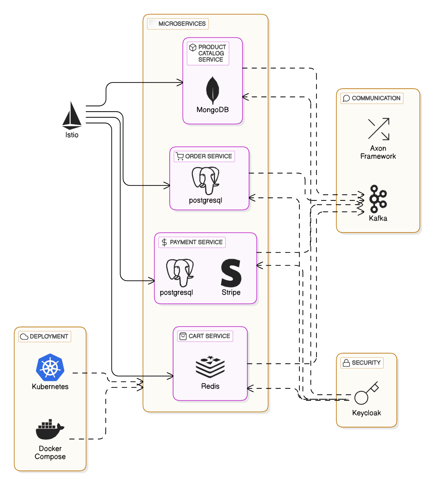

# E-commerce Microservices

Distributed E-commerce back-end platform designed for scalability, security, and high availability. The platform follows a microservices architecture with event-driven communication, ensuring resilience and fault tolerance.
## Features

✅ Microservices-Based Architecture - Independently deployable, modular services.

✅ Secure API Gateway

✅ Authentication & Authorization - Centralized access control with role-based security.

✅ Event-Driven Communication - Services communicate asynchronously to improve responsiveness.

✅ Transaction Management - Distributed transactions with rollback mechanisms ensure consistency.

✅ Containerized & Orchestrated - Supports running in kubernetes

## Architecture


## Services Breakdown

1. Product Catalog Service
   Manages products and inventory.
   Reduces stock on order completion.
   Publicly accessible for viewing, but only admins can add/remove/update products.

2. Order Service
   Handles order placement & completion.
   Publishes events when an order is placed.


3. Payment Service
   Handles payments via Stripe.
   Future support for multiple payment providers.

4. Cart Service
   Stores user cart items before checkout.
## Deployment

first , clone the repo and build the jar files

on linux :

```bash
  git clone https://github.com/Momensamir12/E-commerce.git
  cd E-commerce

  # script to build docker images
  chmod +x build.sh
  ./build.sh
```


Kubernetes
-
You need to have a cluster with load balancers enabled and istio installed.

First run k8s-infra.sh script to setup databases , axon , keycloak , istio manifests

gateway authentication isn't enabled for easier access

```bash
  chmod +x k8s-infra.sh
  ./k8s-infra.sh 
```
then run helm script to install all the services

```bash
  chmod +x helm.sh
  ./helm.sh 
```
you can then access the services through istio's gateway api
```http

http://$ISTIO_GATEWAY_IP/** 
  
```
Jwt Tokens
-
to fully access the platform you need to attach a valid jwt token to your requests using curl or an api tool like postman

```bash

# Request a token from Keycloak
TOKEN_RESPONSE=$(curl -s -X POST "http://$KC_IP:8080/auth/realms/e-commerce/protocol/openid-connect/token" \
  -H "Content-Type: application/x-www-form-urlencoded" \
  -d "grant_type=password" \
  -d "client_id=e-commerce-backend" \
  -d "client_secret=your-client-secret" \
  -d "username=admin" \
  -d "password=123")

# Extract the access token from the response using jq
ACCESS_TOKEN=$(echo $TOKEN_RESPONSE | jq -r .access_token)

# Check if the token was successfully retrieved
if [ "$ACCESS_TOKEN" == "null" ] || [ -z "$ACCESS_TOKEN" ]; then
  echo "Failed to obtain access token. Response: $TOKEN_RESPONSE"
else
  echo "Access token obtained: $ACCESS_TOKEN"
fi
```

you can then access all the back end services endpoints after attaching the token to the request headers


## API Reference

Swagger api documentation endpoints are available for each service on the path
'/service-name/swagger-ui'

Product catalog service :

port : 2025
```http
  /product-service/swagger-ui
```
order service

port : 2022
```http
  /order-service/swagger-ui
```
payment service :

port : 2026
```http
  /payment-service/swagger-ui
```
cart service :

port: 2020
```http
  /cart-service/swagger-ui
```


## Technology Stack

- java 23
- Spring Boot 3.3.4
- Keycloak (OAuth2 provider)
- Axon Framework 4.10.1
- Kafka
- Docker & Kubernetes (Containerization & orchestration)
- MongoDB, PostgreSQL, Redis (Databases)
- Stripe API (Payment integration)
